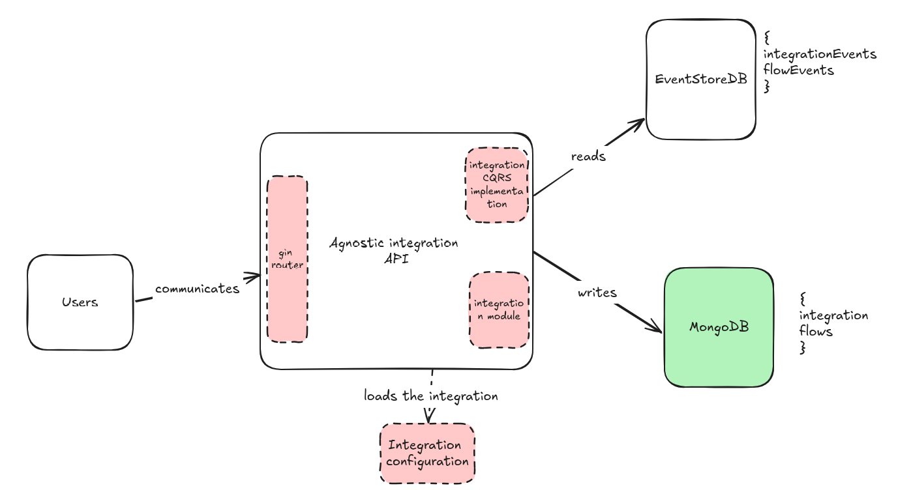
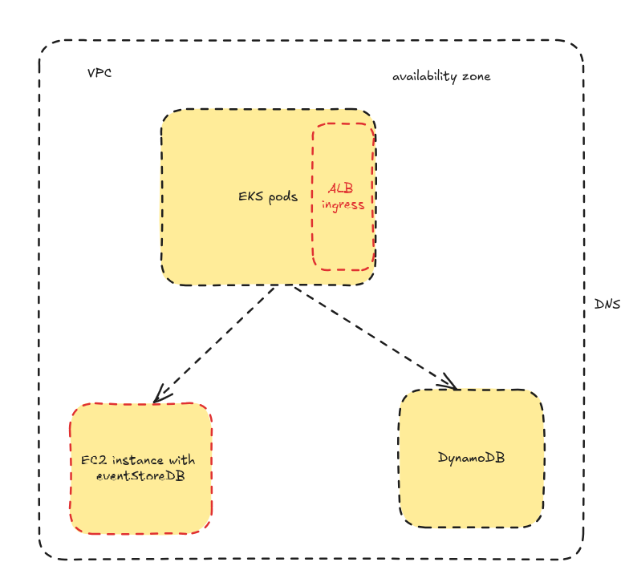

# Agnostic Payment Platform

## Overview

The **Agnostic Payment Platform** is a flexible and extensible payment integration framework designed to work with multiple payment providers without requiring code changes for each new integration. 

This platform enables merchants to process payments and manage transactions with various payment gateways simply by updating configuration files, eliminating the need for hardcoded logic for each provider.


## Features

- **Multi-provider Support**: Easily integrate with numerous payment gateways only with a configuration file.
- **Configurable Integration**: All integration details are handled via configuration files, reducing the need for code changes.
- **Scalable and Extensible**: Designed to scale as new payment methods are required, without requiring developer intervention.
- **Secure Handling**: Sensitive data such as API tokens and authentication details are managed securely within configurations.

## Installation

1. Clone the repository:
   ```bash
   git clone https://github.com/ManuelLecaro/agnostic-payment-platform.git
   cd agnostic-payment-platform
   ```

2. Install docker and docker-compose
3. Setup the configuration files for your integrations, check payments.toml as the example file to set your integrations configuration
4. Setup the configuration files for the application follow config.toml file
5. Execute 
    ```bash
   make dev
   ``` 
   this will setup the app and its dependencies
7. Go to the api [location](http://localhost:8080/swagger/index.html#/)
8. You can go to [storeDB](http://localhost:2113/web/index.html#/streams)
8. Go and check [mongoDB](http://localhost:8081/)

## Configuration

The platform uses a configuration file (payments.toml) to define how to interact with various payment providers. The file contains details such as base URLs, authentication tokens, endpoints, HTTP methods, and parameter mappings. Here's an example of how to configure a provider:

```toml

[[payment_providers]]
name = "example_service"
type = "rest"
base_url = "https://api.example.com/v1"
auth_header = "Authorization"
auth_token = "Bearer TEST_TOKEN"
currency = "usd"
endpoints = [
    { action = "authorize", method = "POST", path = "/payment_intents", params = { "amount" = "{{amount}}", "currency" = "{{currency}}", "payment_method" = "{{card_number}}" } },
    { action = "capture", method = "POST", path = "/payment_intents/{{transaction_id}}/capture", params = {} },
    { action = "refund", method = "POST", path = "/refunds", params = { "payment_intent" = "{{transaction_id}}", "amount" = "{{amount}}" } }
]

```

## Testing

The configuration to simulate the payment is on bankTest, if you want to test a payment you can use bankTest integration.
```bash

curl -X 'POST' \
  'http://localhost:8080/payments' \
  -H 'accept: application/json' \
  -H 'x-api-key: test' \
  -H 'Content-Type: application/json' \
  -d '{
  "amount": 10,
  "card_number": "1234533",
  "currency": "usd",
  "cvv": "1234",
  "expiry_date": "1223",
  "merchant_id": "1",
  "type": "testBank"
}'

```


## Architecture

We are using CQRS for the payments logic flow, in order to handle the supposed huge amount of payment/refund requests at the same time as we have a need for
almost real time reads for furhter necessities like dashboards and metrics processing. 

We are using EventStoreDB as the event store, so we are ready to get the events
from a payment transaction and also are able to plug more functionalities into the application without scaling issues.




## Pros and Cons of Generic vs. Custom Integration Approaches

| **Aspect**               | **Generic Approach (Configuration-Based)**                            | **Custom-Coded Approach**                                          |
|--------------------------|-----------------------------------------------------------------------|--------------------------------------------------------------------|
| **Flexibility**           | **Pro:** High flexibility; add new providers without code changes.    | **Con:** Less flexible; new providers require new code.            |
| **Maintenance**           | **Con:** Configurations can become complex and difficult to maintain. | **Pro:** Easier to maintain as each integration is isolated.       |
| **Initial Complexity**    | **Con:** Higher initial complexity to design a generic system.        | **Pro:** Lower initial complexity; can start with simple code.     |
| **Scalability**           | **Pro:** Scales well with new providers without code changes.         | **Con:** Less scalable; each new provider needs additional code.   |
| **Flow Control**          | **Con:** Less control over provider-specific logic.                   | **Pro:** Maximum control over the integration logic.               |
| **Performance**           | **Con:** Possible overhead from dynamic configuration processing.     | **Pro:** Potentially better performance with optimized code.       |
| **Security**              | **Con:** Managing sensitive data in configurations can be risky.      | **Pro:** Better security control in custom code.                   |
| **Updates and Changes**   | **Pro:** API changes can often be handled with configuration updates. | **Con:** API changes require code updates.                         |
| **Debugging and Testing** | **Con:** Harder to debug and test due to the generic nature.          | **Pro:** Easier to debug and test; each integration is specific.   |
| **Reusability**           | **Pro:** Can be reused across multiple providers without changes.     | **Con:** Less reusable; each provider requires specific logic.     |
| **Development Cost**      | **Con:** Potentially higher development cost upfront.                 | **Pro:** Lower initial development cost for fewer integrations.    |
| **Extensibility**         | **Pro:** Easily extensible by adding new configurations.              | **Con:** Requires code extension for new integrations.             |


# Future work

1. Add terraform configuration to set up necessary components: eks pods for replica and scalling the integration of the API, Route53 for the domain, iam roles, permission groups, ec2 to set up an eventStore instance, dynamoDB as the write model



2. Add integration testing and more unit testing for coverage
3. Setup pipelines for CI/CD
4. Set up linting
5. Set up a message bus to integrate with systems that does not need synchronous communication.